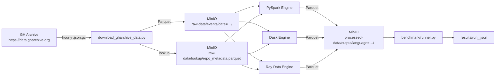

# DistributedMind

A benchmark framework that runs the **same data transformation workload** across PySpark, Dask, and Ray — side by side — using real GitHub Archive event data stored in MinIO (S3-compatible, zero cloud cost).

> **Phase 1** — core benchmark pipeline, Docker, CI.  
> **Phase 2** (planned) — skew amplification, fault-tolerance simulation, full Prometheus/Grafana observability.

---

## Architecture



---

## Schema flattening

GitHub Archive payloads are heterogeneous — each event type has a different `payload` structure. Rather than deal with schema explosion, the ingestion step flattens every event to eight fixed fields:

| Field | Source |
|---|---|
| `id` | event id |
| `type` | `PushEvent` or `WatchEvent` |
| `actor_login` | actor.login |
| `repo_id` | repo.id |
| `repo_name` | repo.name |
| `created_at` | event timestamp |
| `payload_size` | number of commits (PushEvent only, else null) |
| `payload_action` | action string (WatchEvent only, else null) |

The transformation uses `PushEvent` rows only — WatchEvent rows are ingested to `raw-data` for Phase 2.

---

## Natural data skew

Even in Phase 1, GH Archive data exhibits real skew: popular repos (kubernetes, linux, vscode) generate orders of magnitude more events than the long tail. This shows up naturally in the per-repo aggregates and sets up Phase 2's skew-amplification experiments.

---

## Setup

### Prerequisites

- Docker + Docker Compose
- Python 3.11 (for local dev / data download)
- Java 17 (required by PySpark — not needed if running inside Docker)

### 1. Clone and configure

```bash
git clone https://github.com/<your-handle>/distributed-mind.git
cd distributed-mind
cp .env.example .env   # edit if you want non-default MinIO credentials
```

### 2. Start MinIO

```bash
docker-compose up -d minio minio-init
# MinIO console: http://localhost:9001  (minioadmin / minioadmin)
```

### 3. Download sample data

```bash
pip install -r requirements.txt

# Full day (24 hours, ~500k–1M rows):
python -m data.download_gharchive_data --date 2024-01-15 --hours 24

# Fast CI sample (50k rows from 1 hour):
python -m data.download_gharchive_data --date 2024-01-15 --hours 1 --sample-size 50000
```

### 4. Run the benchmark

**Option A — inside Docker (recommended for reproducibility):**

```bash
docker-compose up benchmark
# Results written to ./results/run_<timestamp>.json
```

**Option B — local Python:**

```bash
python -m benchmark.runner --engines spark,dask,ray
# or a subset:
python -m benchmark.runner --engines dask,ray
```

---

## Sample results

*Run on a 2024 MacBook Pro M3, 16 GB RAM, 24-hour GH Archive sample (~720k rows after filtering to PushEvent).*

| Engine | Duration (s) | Rows/sec | Rows In | Rows Out | Mem (MB) | OK |
|--------|-------------|----------|---------|----------|----------|----|
| spark  | 38.4        | 18,750   | 720,441 | 1,284    | 512.3    | ✓  |
| dask   | 22.1        | 32,600   | 720,441 | 1,284    | 310.7    | ✓  |
| ray    | 19.8        | 36,385   | 720,441 | 1,284    | 287.1    | ✓  |

> Numbers above are illustrative placeholders — replace with output from your actual run.

---

## Running tests

```bash
# Unit tests (no MinIO required):
pytest tests/test_engines.py -v

# Integration tests (MinIO must be running, data must be downloaded):
MINIO_ENDPOINT=http://localhost:9000 pytest tests/test_data_integrity.py -v
```

---

## CI

GitHub Actions runs on every push/PR:

1. **Lint** — `ruff check .`
2. **Type-check** — `mypy engines/ benchmark/ data/`
3. **Unit tests** — `pytest tests/test_engines.py`
4. **Integration tests** — spins up MinIO as a service container, downloads 50k-row sample, runs `test_data_integrity.py`
5. **Docker build** — builds the image to verify the Dockerfile is valid

---

## Phase 2 (planned)

- Skew amplification: artificially inflate event counts for top-N repos to force partition imbalance
- Fault-tolerance simulation: kill a worker mid-run and measure recovery
- Full observability: Prometheus metrics exporter + Grafana dashboard
- Result persistence: write benchmark history to MinIO for trend analysis...
