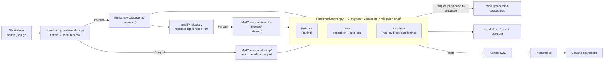

# DistributedMind

A benchmark framework that runs the **same data transformation workload** on PySpark, Dask, and Ray, side by side. It uses real GitHub Archive event data stored in MinIO (S3-compatible, so there's no cloud cost). It then measures how each engine slows down under **data skew**, what **skew mitigation** buys, how each **recovers from worker failures**, and how each **scales across a real multi-node cluster**. Everything is observable in **Prometheus + Grafana**.

[](https://github.com/tusharpanthri/distributed-mind/actions/workflows/ci.yml)

---

## Tech stack

| Area | Technologies |
|---|---|
| Distributed engines | **Apache Spark** (PySpark 3.5, S3A connector), **Dask** (dask-expr DataFrame), **Ray Data** 2.20 |
| Cluster modes | Local (single process) **and multi-node**: Spark **standalone** master + workers, Dask **scheduler + workers**, Ray **head + workers** — each containerized, worker count scaled with Compose |
| Storage & formats | **MinIO** (S3-compatible object store), **Apache Parquet**, **Apache Arrow** (pyarrow, including its S3 filesystem), **s3fs**, MinIO Python SDK |
| Data | **GH Archive** hourly GitHub event dumps (gzipped JSON), flattened to a fixed schema |
| Data processing | **pandas**, NumPy |
| Observability | **Prometheus**, **Prometheus Pushgateway**, **Grafana** (auto-provisioned dashboard), `prometheus-client`, structured JSON logging (`python-json-logger`), `psutil` memory tracking |
| Containers | **Docker** (multi-stage image with Java 17 for Spark), **Docker Compose** (MinIO, benchmark, Pushgateway, Prometheus, Grafana, plus a cluster overlay) |
| CI/CD | **GitHub Actions**: lint, type-check, unit tests, integration tests against a live MinIO, a multi-node cluster smoke test, Docker build |
| Code quality & testing | **pytest** (+ pytest-timeout), **ruff**, **mypy**, type hints throughout |
| Language & CLI | **Python 3.11**, `click` CLIs, YAML config with `${ENV:default}` substitution |

---

## Architecture


```mermaid
flowchart LR
    GHA["GH Archive\nhourly .json.gz"] --> D[download_gharchive_data.py\nflatten → fixed schema]
    D -->|Parquet| RAW["MinIO raw-data/events/\n(balanced)"]
    D -->|Parquet| LOOKUP["MinIO raw-data/lookup/\nrepo_metadata.parquet"]
    RAW --> AMP[amplify_skew.py\nreplicate top-N repos ×10]
    AMP -->|Parquet| SKEW["MinIO raw-data/events-skewed/\n(skewed)"]

    subgraph Matrix["benchmark/runner.py — 3 engines × 2 datasets × mitigation on/off"]
        SPARK["PySpark\n(salting)"]
        DASK["Dask\n(repartition + split_out)"]
        RAY["Ray Data\n(hot-key block partitioning)"]
    end

    RAW --> Matrix
    SKEW --> Matrix
    LOOKUP --> Matrix
    Matrix -->|Parquet, partitioned by language| OUT["MinIO processed-data/output/"]
    Matrix --> RES["results/run_*.json + .parquet"]
    Matrix -->|push| PGW[Pushgateway] --> PROM[Prometheus] --> GRAF[Grafana dashboard]
```

### The workload (identical in all three engines)

1. Read Parquet events from MinIO
2. Keep `PushEvent` rows
3. Group by `repo_id, repo_name` → `event_count`, `unique_actors` (distinct `actor_login`), `avg_payload_size` (commits per push)
4. Left-join a repo-metadata lookup (`language`, `repo_owner_type`; `unknown` when missing)
5. Write Parquet to MinIO, partitioned by `language`

`tests/test_data_integrity.py` checks that all three engines produce the same rows and aggregates. `tests/test_skew.py` checks that each engine's mitigated output is **identical** to its unmitigated output: mitigation changes how the work is spread across workers, never the answer.

### Schema flattening

GH Archive payloads are heterogeneous: each event type has a different nested `payload`. Ingestion flattens every event to eight fixed fields:

| Field | Source |
|---|---|
| `id` | event id |
| `type` | `PushEvent` or `WatchEvent` |
| `actor_login` | actor.login |
| `repo_id` | repo.id |
| `repo_name` | repo.name |
| `created_at` | event timestamp |
| `payload_size` | number of commits (PushEvent only, else null) |
| `payload_action` | action string (WatchEvent only, else null) |

---

## Quick start

Prerequisites: Docker + Docker Compose. For running outside Docker you also need Python 3.11 and Java 17.

```bash
git clone https://github.com/tusharpanthri/distributed-mind.git
cd distributed-mind
cp .env.example .env
```

```bash
docker compose up -d minio minio-init pushgateway prometheus grafana
```

Ingest data (3 hours of GH Archive, about 430k PushEvents), then build the skewed copy:

```bash
docker compose run --rm benchmark -m data.download_gharchive_data --date 2024-01-15 --hours 3
```

```bash
docker compose run --rm benchmark -m data.amplify_skew
```

Run the full 12-configuration matrix (3 repeats each, median reported), then a fault-injection pass:

```bash
docker compose run --rm benchmark
```

```bash
docker compose run --rm benchmark -m benchmark.runner --simulate-failure
```

Then open Grafana at http://localhost:3000. The *DistributedMind* dashboard is the home page, and anonymous viewing is on (admin/admin to edit). Prometheus is at http://localhost:9090 and the MinIO console at http://localhost:9001 (minioadmin/minioadmin).

Useful runner flags:

```bash
python -m benchmark.runner --engines dask,ray --datasets balanced,skewed --mitigation off,on --repeats 3 --simulate-failure --metrics-port 8000
```

For fast iteration, a smaller sample works too: `--hours 1 --sample-size 50000`, which is what CI uses.

### Multi-node clusters

Everything above runs in local mode. The `docker-compose.cluster.yml` overlay swaps that for real clusters — Spark standalone, a Dask scheduler, and a Ray head, each with scalable worker containers — and points the benchmark driver at them:

```bash
docker compose -f docker-compose.yml -f docker-compose.cluster.yml up -d --scale spark-worker=2 --scale dask-worker=2 --scale ray-worker=2
```

```bash
CLUSTER_WORKERS=2 docker compose -f docker-compose.yml -f docker-compose.cluster.yml run --rm benchmark -m benchmark.runner --cluster-workers 2
```

To sweep the worker count and report speedup and efficiency (this brings up only the engine under test at each step, so a laptop never hosts three clusters at once):

```bash
python scripts/scaling_sweep.py --workers 1,2,4 --datasets balanced,skewed
```

The Spark master UI is at http://localhost:8080 and the Dask dashboard at http://localhost:8787.

---

## Results

Measured with `docker compose run --rm benchmark` on a Windows 11 desktop (Docker Desktop, 16 vCPU / 14 GB), **each engine limited to 4 cores** (Spark `local[4]`, Dask 2 workers × 2 threads, Ray `num_cpus=4`). Each engine got one untimed warmup, then **the median of 3 runs** per configuration.

The data is GH Archive 2024-01-15, hours 0–2:

- **balanced:** 432,459 PushEvents over 119,942 repos
- **skewed:** the top-5 repos replicated ×10 → 772,389 PushEvents. The top repo's share goes 1.75% → 9.82%, the top-5 share goes 8.73% → 48.90%, and max/median events per repo goes 7,581× → 75,810×.

The whole 12-run matrix (36 timed runs plus warmups) takes **3m39s**.

| Engine | Dataset | Mitigation | Duration (s) | Rows/sec | Rows in | Rows out | Skew slowdown |
|---|---|---|---:|---:|---:|---:|---:|
| spark | balanced | off | 3.08 | 140,596 | 432,459 | 119,942 | |
| spark | balanced | on  | 3.36 | 128,898 | 432,459 | 119,942 | |
| spark | skewed   | off | 3.40 | 227,140 | 772,389 | 119,942 | **1.11×** |
| spark | skewed   | on  | 3.98 | 193,926 | 772,389 | 119,942 | **1.19×** |
| dask  | balanced | off | 2.80 | 154,461 | 432,459 | 119,942 | |
| dask  | balanced | on  | 6.40 | 67,598  | 432,459 | 119,942 | |
| dask  | skewed   | off | 2.98 | 258,900 | 772,389 | 119,942 | **1.07×** |
| dask  | skewed   | on  | 7.13 | 108,338 | 772,389 | 119,942 | **1.11×** |
| ray   | balanced | off | 4.04 | 107,139 | 432,459 | 119,942 | |
| ray   | balanced | on  | 4.97 | 87,016  | 432,459 | 119,942 | |
| ray   | skewed   | off | 6.32 | 122,254 | 772,389 | 119,942 | **1.57×** |
| ray   | skewed   | on  | 6.93 | 111,412 | 772,389 | 119,942 | **1.39×** |

*Skew slowdown* = skewed duration ÷ balanced duration for the same engine and mitigation setting. The skewed dataset has 1.79× the rows, so any ratio below 1.79 means per-row throughput held up under skew. Every configuration produces the same 119,942 output rows, and the tests check the values match too.

**What the numbers say**

- **Spark and Dask shrug off key skew on this workload.** Both do **map-side partial aggregation** before the shuffle: Spark's `HashAggregate` runs a partial and a final stage, and Dask's groupby uses a tree reduction. So the 10× replicated rows of a hot repo collapse to one partial row per partition before any worker has to handle them. Skew adds only 7–11%.
- **Ray is the most skew-sensitive (1.57×).** Its key-partitioned path has no map-side combine, so every row of a hot repo lands in one bucket and one task becomes a straggler. Mitigation cuts the slowdown to **1.39×**.
- **Mitigation isn't free.** On the balanced dataset every mitigated run is slower (Spark +9%, Ray +23%, Dask +129%). Each mitigated run pays for a hot-key detection pass and an extra shuffle stage. Dask pays most because its extra `split_out` shuffles are task-based.
- **Fixed overhead dominates at this size.** At a few seconds per job, scheduling and I/O setup are a large share of the runtime. That's why Dask, the lightest-weight scheduler here, leads on raw duration. The ranking can change at larger scale.

> **Ray Data implementation note.** Ray 2.20's built-in `groupby().aggregate()` and `map_groups` iterate over groups in Python. With 120k repo keys that took **240 s** (built-in aggregations) or **65 s** (`map_groups`) for the balanced dataset. The engine therefore hash-partitions rows into `2 × num_cpus` buckets, groups on the low-cardinality bucket id, and aggregates each bucket with vectorized pandas: **4.0 s**.

---

## Scaling (multi-node)

Local mode can only tell you which engine is fastest on one box. This section runs the **same workload against real clusters** — Spark standalone, a Dask scheduler, and a Ray head, each with worker containers — and sweeps the worker count to see how much of each extra worker actually becomes throughput.

Measured with `python scripts/scaling_sweep.py --workers 1,2,4 --datasets balanced,skewed`, on a full **24h GH Archive day** (3,682,194 PushEvents balanced / 6,240,579 skewed, over 572,369 repos). Every worker gets an identical budget of **2 cores and 2 GB**, so 4 workers = 8 cores. Mitigation is off throughout. The whole sweep (18 runs) takes **17m22s**.

| Engine | Dataset | Workers | Cores | Duration (s) | Rows/sec | Speedup | Efficiency |
|---|---|---:|---:|---:|---:|---:|---:|
| spark | balanced | 1 | 2 | 12.80 | 287,627 | 1.00× | 100% |
| spark | balanced | 2 | 4 | 11.37 | 323,789 | 1.13× | 56% |
| spark | balanced | 4 | 8 | 10.62 | 346,794 | **1.21×** | **30%** |
| spark | skewed | 1 | 2 | 14.29 | 436,705 | 1.00× | 100% |
| spark | skewed | 2 | 4 | 10.29 | 606,486 | 1.39× | 69% |
| spark | skewed | 4 | 8 | 11.74 | 531,552 | **1.22×** | **30%** |
| dask | balanced | 1 | 2 | 14.61 | 252,051 | 1.00× | 100% |
| dask | balanced | 2 | 4 | 10.20 | 360,858 | 1.43× | 72% |
| dask | balanced | 4 | 8 | 8.18 | 450,134 | **1.79×** | **45%** |
| dask | skewed | 1 | 2 | 18.95 | 329,268 | 1.00× | 100% |
| dask | skewed | 2 | 4 | 12.65 | 493,286 | 1.50× | 75% |
| dask | skewed | 4 | 8 | 9.88 | 631,405 | **1.92×** | **48%** |
| ray | balanced | 1 | 2 | 59.35 | 62,045 | 1.00× | 100% |
| ray | balanced | 2 | 4 | 37.68 | 97,730 | 1.58× | 79% |
| ray | balanced | 4 | 8 | 24.75 | 148,746 | **2.40×** | **60%** |
| ray | skewed | 1 | 2 | 89.68 | 69,589 | 1.00× | 100% |
| ray | skewed | 2 | 4 | 53.80 | 116,006 | 1.67× | 83% |
| ray | skewed | 4 | 8 | 40.31 | 154,798 | **2.22×** | **56%** |

*Speedup* is the 1-worker duration ÷ this duration. *Efficiency* is speedup ÷ the worker-count factor: 100% would be perfectly linear, 50% means half of each added worker is wasted. All 18 runs produced the same 572,369 output rows.

**What the numbers say**

- **Nobody scales linearly, and the ranking flips depending on what you ask.** Dask is fastest in absolute terms at every worker count (8.18s on 4 workers). Ray is the slowest but scales best (2.40×, 60% efficiency). Spark barely benefits from more workers at all (1.21×, 30%).
- **Ray scales best because it has the most work to parallelize.** Its per-row Python processing is CPU-bound, and CPU-bound work is exactly what extra cores absorb. Spark and Dask push the same aggregation into vectorized/JVM code, so they start near the floor set by I/O and coordination and have less left to win.
- **Spark's fixed overhead dominates at this size.** A ~12s job spends a large share on job setup, S3A listing, and shuffle scaffolding, none of which shrinks when workers are added. Spark's skewed run at 4 workers (11.74s) is actually *slower* than at 2 (10.29s) — past a point, more executors mean more shuffle partitions and more coordination for the same work.
- **Efficiency decays the same way for everyone**, which is Amdahl's law showing up: each job has a serial tail (driver-side assembly of the ~572k-row result, the lookup join, and the write) that no number of workers can shrink. That tail is why even Ray lands at 60% rather than near 100%.
- **Skew doesn't change the scaling story.** Speedup curves for balanced and skewed data are close for all three engines, which is consistent with the Phase 2 finding that key skew is mostly absorbed by map-side partial aggregation.

**Caveats worth stating.** These are single-host containers, so "network" between workers is loopback — real multi-machine clusters pay more for shuffles, which would likely lower efficiency further. Each configuration was run once (`--repeats 1`); the ±1s of run-to-run noise doesn't change any of the conclusions above, but it does explain small non-monotonic wobbles like Spark's skewed 2→4 worker result.

---

## Skew mitigation techniques

`data/amplify_skew.py` ranks repos by **PushEvent** count (the workload only aggregates pushes) and replicates every row of the top-N repos `--skew-factor` times. Each copy gets a unique event id and keeps its actor, so `unique_actors` is unchanged and only `event_count` grows. The balanced data stays in place, and the skewed copy goes to `raw-data/events-skewed/` with the same `date=` layout.

Each engine's `run()` takes `dataset_type` and `mitigate_skew`. With mitigation on, each engine first finds the hot keys itself (the top `hot_key_top_n` repos), so detection is part of the measured cost:

| Engine | Technique | How it works |
|---|---|---|
| **Spark** | **Salting** | Rows of hot repos get `salt = pmod(hash(id), N)`. Counts and payload sums are aggregated per `(repo, salt)`, then summed per repo. A distinct count can't be summed across random salts, so `unique_actors` comes from de-duplicated `(repo, actor)` pairs. That shuffle is keyed on the actor too, so a hot repo spreads out, and map-side dedupe collapses bot accounts. |
| **Dask** | **Distribution-aware repartition** | Rebalances input into `2 × workers × threads` equal partitions (one big Parquet file otherwise lands in a single partition). It salts hot repos so they hash to different output partitions via `split_out`, combines the partials, and counts distinct actors from `drop_duplicates(split_out=…)` pairs. |
| **Ray** | **Custom block partitioning** | Every block is pre-aggregated locally to one row per `(repo, actor)` (map-side combine). Partials of hot repos are then spread across **all** buckets by hashing the *actor*, while long-tail repos hash by repo. Actor sets per bucket are disjoint, so per-bucket distinct counts still sum exactly. |

Correctness is tested at two levels. Unit tests check that each partial/combine helper reproduces a direct pandas aggregate exactly. Integration tests check that every engine's mitigated output equals its unmitigated output on the real skewed data.

Measured effect: mitigation lowered Ray's skew slowdown from 1.57× to 1.39×. It didn't help Spark or Dask, whose built-in partial aggregation already neutralizes key skew for a combinable aggregate like this one. Salting pays off where there's no combiner: skewed **joins**, per-key UDFs, `collect_list`-style aggregates, or a hot key too big for one executor's memory.

---

## Fault tolerance

`--simulate-failure` makes the first attempt of every **skewed** run raise `InjectedWorkerFailure` **inside a task running on a worker**, not on the driver. That happens partway through the job, after the read and filter and before the aggregation:

| Engine | Where the failure is raised | What the engine does |
|---|---|---|
| Spark | a Python UDF evaluated in an executor task | task fails; `local[N]` allows 1 task attempt, so the job aborts with a `PythonException` |
| Dask | a `map_partitions` function on a worker process | task errors; `persist()`/`compute` re-raises on the client |
| Ray | a `map_batches` task | task errors; Ray Data doesn't retry application exceptions by default and aborts the dataset |

`BenchmarkEngine.run` (shared by all three engines) catches the failure and retries the job with exponential backoff: `delay = min(backoff_max, backoff_base · 2^attempt)`, with `max_retries` from `config/benchmark_config.yaml`. It records `retry_count` and `recovery_time_seconds` (first failure → successful completion). Clean timing runs and fault runs push to separate Prometheus jobs, so injected failures never skew the timing panels.

Measured recovery from `docker compose run --rm benchmark -m benchmark.runner --simulate-failure`. Every job succeeded after 1 retry, with 0 failed jobs:

| Engine | Mitigation | Retries | Recovery time (s) | Skewed duration with failure (s) | Clean skewed duration (s) |
|---|---|---:|---:|---:|---:|
| spark | off | 1 | 4.64 | 5.72 | 3.40 |
| spark | on  | 1 | 5.01 | 5.37 | 3.98 |
| dask  | off | 1 | 3.86 | 4.63 | 2.98 |
| dask  | on  | 1 | 7.61 | 8.21 | 7.13 |
| ray   | off | 1 | 7.21 | 7.65 | 6.32 |
| ray   | on  | 1 | 7.75 | 8.16 | 6.93 |

Recovery time is roughly one backoff (0.5 s) plus a full re-run, because the failure is raised early in the job. The added wall time over a clean run is 1–2.3 s. `tests/test_fault_tolerance.py` checks the retry/backoff logic (including the capped exponential schedule and giving up after `max_retries`) and that each real engine recovers from an injected worker failure.

---

## Observability

Benchmark runs are **batch jobs**: they finish before Prometheus's next scrape. So the runner pushes its metrics to a **Pushgateway**, which Prometheus scrapes, which is the standard pattern for batch work. `--metrics-port` additionally serves `/metrics` live while a run is in progress.

| Metric | Type | Labels |
|---|---|---|
| `job_duration_seconds` | histogram | engine, dataset_type, mitigation |
| `job_last_duration_seconds` | gauge | engine, dataset_type, mitigation |
| `rows_processed_total` | counter | engine, dataset_type, mitigation |
| `job_failures_total` | counter | engine, dataset_type, mitigation |
| `job_retries_total` | counter | engine, dataset_type, mitigation |
| `skew_slowdown_ratio` | gauge | engine, mitigation |
| `recovery_time_seconds` | histogram | engine, dataset_type, mitigation |
| `last_recovery_time_seconds` | gauge | engine, dataset_type, mitigation |

Clean timing runs push as job `distributedmind_benchmark`, and `--simulate-failure` runs push as `distributedmind_fault_injection`. That way, retry and backoff time never pollutes the duration and skew panels. The Grafana dashboard (`observability/grafana/dashboards/distributedmind.json`, auto-provisioned) shows:

- duration by engine × dataset × mitigation
- skew slowdown ratio with vs without mitigation
- throughput
- recovery time
- a failure/recovery timeline

Every component also logs structured JSON.

---

## Cost implications

What would the measured throughput cost on AWS? This is a cost model only; nothing runs in the cloud. Each engine used 4 cores, which maps to one **m5.xlarge** (4 vCPU, 16 GiB; every run's peak memory stayed well under 1 GB). Prices are us-east-1 on-demand list prices: **$0.192/h** for EC2, and **+$0.048/h** EMR uplift for Spark on EMR.

| Engine (platform) | $/hour | Rows/sec (balanced, no mitigation) | Cost per 1B PushEvents | With mitigation |
|---|---:|---:|---:|---:|
| Spark (EMR) | $0.240 | 140,596 | **$0.47** | $0.52 |
| Dask (EC2)  | $0.192 | 154,461 | **$0.35** | $0.79 |
| Ray (EC2)   | $0.192 | 107,139 | **$0.50** | $0.61 |

Cost per 1B rows = (1e9 / rows_per_sec) / 3600 × $/hour. Takeaways for production:

- **At equal cores, Dask was about 25% cheaper than Spark on EMR** for this aggregation, and Spark's EMR uplift alone is 25% of its bill. At scale, Spark's advantages (AQE, a mature S3A connector, spill-to-disk) usually justify that, and EMR on Spot or EMR Serverless changes the maths.
- **Always-on mitigation is a cost, not a safety net.** It roughly doubles Dask's bill and adds 10–20% for Spark and Ray on data that doesn't need it. Enable it only when hot keys are detected, since detection is itself a cheap `groupBy().count()`.
- These figures come from about 3 s jobs, where fixed overhead is a big share of the runtime. Linear extrapolation to billions of rows is optimistic for all three engines, but it's consistent across them, so the relative comparison holds.

---

## Running tests

```bash
pytest -m "not integration"
```

Unit tests need no infrastructure: the retry/backoff loop, the skew amplifier, the slowdown ratio, and exactness of the partial-aggregation helpers.

With MinIO running and data ingested plus amplified, run the integration tests:

```bash
MINIO_ENDPOINT=http://localhost:9000 pytest -m integration
```

They cover cross-engine data integrity, the skewed dataset's distribution, mitigated == unmitigated output for every engine, and recovery from injected worker failures for every engine.

## CI

GitHub Actions on every push/PR:

1. `ruff check .` and `mypy`
2. Unit tests
3. Integration tests: starts MinIO, ingests a 50k-row sample, builds the skewed dataset, runs every integration test
4. Cluster smoke: brings up all three clusters with one worker each and runs a job per engine against them, asserting matching row counts. Because the engines fail fast when no worker registers, this genuinely proves each driver reached its scheduler
5. `docker compose config` validation and a Docker image build

## Project layout

```
benchmark/     runner (matrix, CLI), metrics (timing, memory, Prometheus), scaling maths, results writer
engines/       base (retry/backoff, failure injection), spark_engine, dask_engine, ray_engine
data/          download_gharchive_data (ingest + flatten), amplify_skew
scripts/       scaling_sweep.py (worker-count sweep, host-side)
observability/ prometheus.yml, Grafana provisioning + dashboard
tests/         test_engines, test_data_integrity, test_skew, test_fault_tolerance, test_scaling
config/        benchmark_config.yaml
docker-compose.yml + docker-compose.cluster.yml (multi-node overlay)
```
